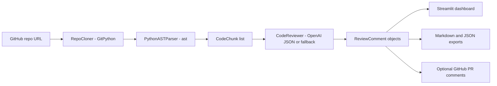

# AI Code Review Agent

An autonomous Streamlit app that clones public GitHub repositories, parses Python files with `ast`, chunks large files safely, reviews each chunk with an LLM, and displays confidence-rated review comments.

## Features

- GitHub ingestion with URL normalization, shallow clone, timeout handling, cache, and friendly failure messages.
- Python AST parsing for imports, classes, functions, syntax errors, and line-preserving chunks.
- Large-file chunking so long functions and modules remain reviewable.
- OpenAI `gpt-4o-mini` structured JSON review when `OPENAI_API_KEY` is set.
- Deterministic fallback reviewer for demo/tests when no API key is available.
- Confidence scores from 0-100 percent, with comments below 60 percent shown as `verify this`.
- Streamlit dashboard with severity/category/confidence filters and Markdown/JSON downloads.
- Optional GitHub PR comment helper for high-confidence comments.

## Setup

```bash
pip install -r requirements.txt
set OPENAI_API_KEY=your_key_here
streamlit run app.py
```

For a no-key local demo:

```bash
python coder.py psf/requests --no-llm
```

## Architecture



## Project Structure

- `agent/cloner.py` - repository clone and validation.
- `agent/parser.py` - AST parsing and chunk generation.
- `agent/reviewer.py` - LLM prompt, schema parsing, fallback checks.
- `agent/models.py` - typed review data models.
- `agent/output.py` - Markdown/JSON export and optional PR posting.
- `agent/pipeline.py` - end-to-end orchestration.
- `app.py` - Streamlit dashboard.
- `coder.py` - CLI runner.
- `test_coder.py` - focused parser/reviewer tests.
- `test_cloner.py` - clone edge-case tests.

## Known Limitations

- AST extraction currently targets Python. JavaScript/Go can be added with tree-sitter.
- Inline GitHub PR comments require a valid token, PR number, and commit SHA.
- LLM quality depends on repository context; this version reviews chunks independently.
- Very large repositories are capped by `max_chunks` for speed and cost control.

## What I Would Build Next

- tree-sitter support for JavaScript and Go.
- Cross-file context retrieval for imports and call sites.
- PR diff-aware review mode to comment only on changed lines.
- Persistent run history and comparison across commits.
- Evaluation harness with known-bug repositories and JSON schema conformance metrics.

## Test Repositories

Use public repositories only and cite any repositories used in the demo recording. Good small examples include `karpathy/micrograd`, `pallets/flask`, and your own test repository.
