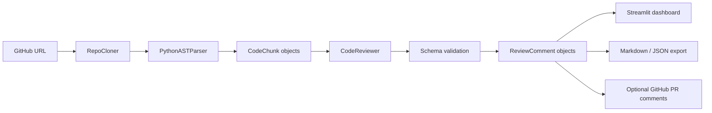

# AI Code Review Agent

An autonomous Streamlit application that clones a public GitHub repository, parses Python source with `ast`, chunks large files, sends reviewable chunks to an LLM, and returns structured code review comments with severity ratings and self-rated confidence scores.

Low-confidence comments are separated into a `verify this` workflow so the agent can surface uncertainty instead of pretending every finding is equally reliable.

## Core Features

- Repository ingestion with GitPython, URL normalization, shallow clone, timeout handling, session cache, and readable failure messages.
- Python AST extraction for imports, classes, functions, syntax errors, and line-preserving code chunks.
- Large-file and long-function chunking with a configurable review cap.
- LLM provider choice between Google AI Studio / Gemini and OpenAI.
- Structured JSON prompting plus schema validation and normalization before comments reach the UI.
- Deterministic local fallback checks for demos and tests without an API key.
- Confidence scoring from 0-100 percent with a low-confidence `verify this` bucket.
- Streamlit dashboard with health score, filters, low-confidence view, and Markdown/JSON downloads.
- Optional GitHub PR comment posting for high-confidence comments.

## Tech Stack

- Ingestion: `GitPython`
- Parsing: Python `ast`
- LLMs: Google AI Studio / Gemini or OpenAI
- Orchestration: Python pipeline modules
- Output: Markdown, JSON, optional GitHub REST API comments
- Dashboard: Streamlit
- Tests: pytest

## Setup

```bash
pip install -r requirements.txt
```

For Google AI Studio:

```bash
set GEMINI_API_KEY=your_google_ai_studio_key_here
python coder.py karpathy/micrograd --provider google --model gemini-2.5-flash
```

For OpenAI:

```bash
set OPENAI_API_KEY=your_openai_key_here
python coder.py karpathy/micrograd --provider openai --model gpt-4o-mini
```

For a no-key demo:

```bash
python coder.py karpathy/micrograd --no-llm
```

Run the dashboard:

```bash
streamlit run app.py
```

The Streamlit sidebar also accepts a temporary Google AI Studio or OpenAI API key for the current session.

## Architecture



## Project Structure

- `agent/cloner.py` - GitHub clone, validation, timeout, cleanup, and cache logic.
- `agent/parser.py` - Python AST parsing and chunk creation.
- `agent/reviewer.py` - Google AI Studio/OpenAI provider calls, prompt construction, retry, and fallback review.
- `agent/schema.py` - model-output schema validation and normalization.
- `agent/models.py` - shared dataclasses for chunks, comments, and review runs.
- `agent/output.py` - Markdown/JSON export and optional GitHub PR comment posting.
- `agent/pipeline.py` - end-to-end orchestration.
- `app.py` - Streamlit dashboard.
- `coder.py` - CLI runner.
- `test_coder.py` - parser, schema, provider, fallback, and pipeline tests.
- `test_cloner.py` - live GitHub clone edge-case tests.

## Testing

Run unit tests:

```bash
python -m pytest test_coder.py -q
```

Run live clone tests:

```bash
python test_cloner.py
```

The clone tests require internet access because they use public GitHub repositories.

Recommended manual test repos:

- `karpathy/micrograd` - small, fast smoke test.
- `pallets/flask` - larger Python project.
- A small custom repository with an intentional `eval`, syntax error, or broad exception handler.

## Deployment

See `DEPLOYMENT.md` for Streamlit Cloud and HuggingFace Spaces steps.

Minimum Streamlit Cloud settings:

- Repository: this project repository.
- Entrypoint: `app.py`.
- Secrets: `GEMINI_API_KEY`, optionally `OPENAI_API_KEY` and `GITHUB_TOKEN`.

## GitHub PR Comments

The dashboard includes an optional `GitHub PR comments` form in the Download tab. It requires:

- `owner/repo`
- pull request number
- commit SHA
- `GITHUB_TOKEN` or a pasted token

Only high-confidence comments are posted. Low-confidence comments remain in the `verify this` bucket.

## Known Limitations

- AST parsing currently supports Python only.
- Chunks are reviewed independently, so cross-file reasoning is limited.
- GitHub inline PR comments work best on changed lines that GitHub can map to the pull request diff.
- Large repositories are capped by the `max_chunks` setting for cost and latency control.
- LLM providers can still return weak comments; schema validation controls shape, not factual correctness.

## What I Would Build Next

- tree-sitter support for JavaScript and Go.
- Diff-aware PR review mode that comments only on changed lines.
- Repo-level context retrieval for imports, call sites, and tests.
- Persistent run history with comparison across commits.
- A benchmark suite with seeded bugs and measured false-positive rates.

## Demo Flow

1. Start the Streamlit app.
2. Select Google AI Studio or OpenAI.
3. Review `karpathy/micrograd` live.
4. Show severity/category/confidence filters.
5. Open the `verify this` tab.
6. Download Markdown/JSON.
7. If claiming the GitHub API bonus, post high-confidence comments to a real PR.
